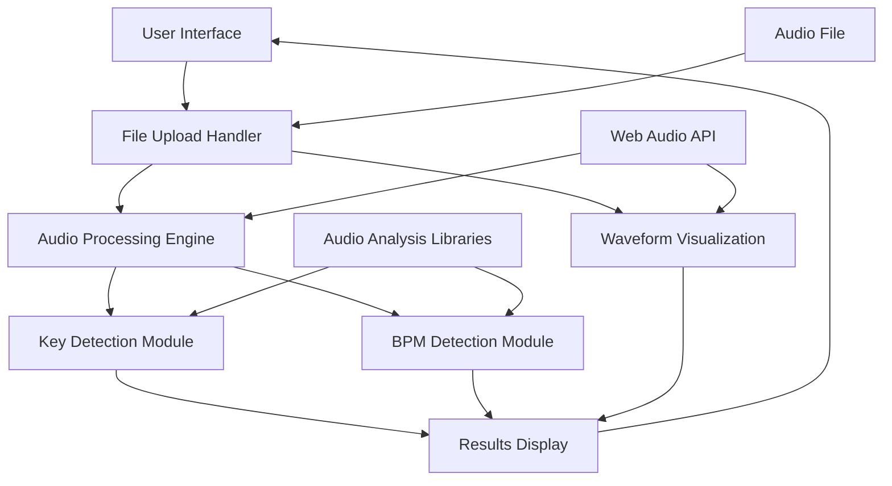

# Design Document

## Overview

The Audio Key and BPM Analyzer is a web application that provides real-time analysis of hip hop instrumental audio files. The system uses client-side audio processing with Web Audio API and specialized JavaScript libraries for key and BPM detection, ensuring fast processing and user privacy by keeping audio files local to the user's browser.

## Architecture

The application follows a client-side architecture with the following key components:



### Technology Stack
- **Frontend Framework**: React with TypeScript for component-based architecture
- **UI Framework**: Chakra UI for consistent, accessible, and responsive design components
- **Audio Processing**: Web Audio API for audio file handling and preprocessing
- **Waveform Visualization**: HTML5 Canvas for rendering red waveform display
- **Key Detection**: Chroma.js or similar library for musical key analysis
- **BPM Detection**: Web-based BPM detection algorithm (custom implementation or library like `web-audio-beat-detector`)

### Design System
- **Color Scheme**: Minimal 3-color palette
  - Background: White (#FFFFFF)
  - Text: Black (#000000)  
  - Waveform: Red (#FF0000)
- **Typography**: Clean, readable fonts with good contrast
- **Layout**: Simple, focused interface with clear visual hierarchy

## Components and Interfaces

### 1. File Upload Component
**Purpose**: Handle file selection, validation, and preparation for analysis using Chakra UI

**Interface**:
```typescript
interface FileUploadProps {
  onFileSelect: (file: File) => void
  isProcessing: boolean
  acceptedFormats: string[]
}

const FileUpload: React.FC<FileUploadProps>

// Supporting hook
const useFileUpload = () => {
  validateFile(file: File): ValidationResult
  loadAudioFile(file: File): Promise<AudioBuffer>
  getSupportedFormats(): string[]
}
```

**Responsibilities**:
- File format validation (MP3, WAV, FLAC, M4A)
- File size validation (max 50MB)
- Audio file loading and conversion to AudioBuffer
- Error handling for unsupported formats
- Use Chakra UI's drag-and-drop file input styling

### 2. Audio Processing Engine
**Purpose**: Coordinate audio analysis and manage processing pipeline

**Interface**:
```typescript
class AudioProcessor {
  processAudio(audioBuffer: AudioBuffer): Promise<AnalysisResult>
  getAudioFeatures(audioBuffer: AudioBuffer): AudioFeatures
  normalizeAudio(audioBuffer: AudioBuffer): AudioBuffer
}

// React hook for audio processing
const useAudioProcessor = () => {
  processAudio: (audioBuffer: AudioBuffer) => Promise<AnalysisResult>
  isProcessing: boolean
  progress: number
  error: string | null
}
```

**Responsibilities**:
- Audio preprocessing and normalization
- Coordinate key and BPM detection
- Manage processing progress and timeouts
- Handle analysis errors
- Integrate with React state management

### 3. Key Detection Module
**Purpose**: Analyze audio to determine musical key

**Interface**:
```typescript
class KeyDetector {
  detectKey(audioBuffer: AudioBuffer): Promise<KeyResult>
  extractChromaFeatures(audioBuffer: AudioBuffer): ChromaVector
  calculateKeyProfile(chromaVector: ChromaVector): KeyProfile
}
```

**Responsibilities**:
- Extract chroma features from audio
- Apply key detection algorithms (Krumhansl-Schmuckler or similar)
- Return key name and confidence score
- Handle major/minor key classification

### 4. BPM Detection Module
**Purpose**: Analyze audio to determine beats per minute

**Interface**:
```typescript
class BPMDetector {
  detectBPM(audioBuffer: AudioBuffer): Promise<BPMResult>
  extractOnsets(audioBuffer: AudioBuffer): OnsetTimes[]
  calculateTempo(onsets: OnsetTimes[]): number
}
```

**Responsibilities**:
- Extract onset detection from audio
- Apply tempo estimation algorithms
- Filter and validate BPM results
- Handle tempo variations and provide stable BPM

### 5. Waveform Visualization Component
**Purpose**: Display audio waveform similar to SoundCloud interface

**Interface**:
```typescript
interface WaveformProps {
  audioBuffer: AudioBuffer
  isLoading: boolean
  progress?: number
}

const WaveformDisplay: React.FC<WaveformProps>

// Supporting hook
const useWaveform = () => {
  generateWaveformData(audioBuffer: AudioBuffer): WaveformData
  drawWaveform(canvas: HTMLCanvasElement, data: WaveformData): void
}
```

**Responsibilities**:
- Generate waveform visualization data from AudioBuffer
- Render red waveform on HTML5 Canvas
- Show processing progress overlay on waveform
- Handle responsive canvas sizing

### 6. Results Display Component
**Purpose**: Present analysis results to the user using Chakra UI components

**Interface**:
```typescript
interface ResultsDisplayProps {
  analysisResult?: AnalysisResult
  isLoading: boolean
  error?: string
  onReset: () => void
}

const ResultsDisplay: React.FC<ResultsDisplayProps>
```

**Responsibilities**:
- Display key and BPM prominently using Chakra UI Cards and Text components
- Show confidence scores as percentages (e.g., "85% confidence")
- Show processing progress with Chakra UI Progress component
- Handle error states with Chakra UI Alert components
- Allow for new file uploads with Chakra UI Button components
- Use simple color scheme: white background, black text

## Data Models

### AudioFile
```typescript
interface AudioFile {
  file: File
  name: string
  size: number
  format: string
  duration: number
}
```

### AnalysisResult
```typescript
interface AnalysisResult {
  key: KeyResult
  bpm: BPMResult
  confidence: ConfidenceScores
  processingTime: number
}
```

### KeyResult
```typescript
interface KeyResult {
  keyName: string        // e.g., "C Major", "A Minor"
  keySignature: string   // e.g., "C", "Am"
  confidence: number     // 0-1 confidence score (displayed as percentage)
  mode: 'major' | 'minor'
}
```

### BPMResult
```typescript
interface BPMResult {
  bpm: number           // Rounded to nearest integer
  confidence: number    // 0-1 confidence score (displayed as percentage)
  detectedBeats: number // Number of beats detected
}
```

### WaveformData
```typescript
interface WaveformData {
  peaks: number[]
  duration: number
  sampleRate: number
  channels: number
}
```

### UI State Management
```typescript
interface AppState {
  currentFile: AudioFile | null
  audioBuffer: AudioBuffer | null
  waveformData: WaveformData | null
  analysisResult: AnalysisResult | null
  isProcessing: boolean
  progress: number
  error: string | null
}
```

## Error Handling

### File Upload Errors
- **Unsupported Format**: Display supported formats and suggest conversion
- **File Too Large**: Show size limit and suggest compression
- **Corrupted File**: Indicate file may be damaged

### Processing Errors
- **Analysis Timeout**: Show timeout message and suggest shorter file
- **Insufficient Audio Data**: Indicate file may be too short or quiet
- **Processing Failure**: Generic error with retry option

### Browser Compatibility
- **Web Audio API Unavailable**: Show browser compatibility message
- **Insufficient Memory**: Suggest closing other tabs or using smaller file

## Testing Strategy

### Unit Testing
- File validation logic
- Audio processing algorithms
- Key detection accuracy with known samples
- BPM detection accuracy with known samples
- Error handling scenarios

### Integration Testing
- End-to-end file upload and analysis workflow
- Cross-browser compatibility testing
- Performance testing with various file sizes
- Mobile device responsiveness

### User Acceptance Testing
- Test with real hip hop instrumental files
- Validate accuracy against known key/BPM values
- Usability testing on different devices
- Performance testing with typical file sizes

### Test Data
- Curated set of hip hop instrumentals with known key/BPM values
- Edge cases: very fast/slow tempos, complex keys, poor audio quality
- Various file formats and sizes for validation

## Performance Considerations

### Client-Side Processing
- Use Web Workers for audio analysis to prevent UI blocking
- Implement progressive loading for large files
- Cache analysis results for repeated uploads of same file

### Memory Management
- Release AudioBuffer objects after processing
- Implement garbage collection triggers for large files
- Monitor memory usage during processing

### User Experience
- Show immediate feedback on file selection
- Display red waveform visualization immediately after file upload
- Display progress indicators during analysis overlaid on waveform
- Provide estimated completion times for processing
- Maintain simple, clean interface with minimal color palette